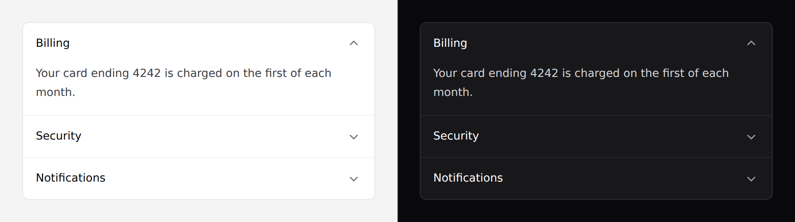

# Accordion

Sections that expand one at a time. Covers `accordion` and `accordion-item`.



> **Needs Alpine.** See [getting started](../getting-started.md#alpine).

## Use it

```blade
<x-ds::accordion open="billing">
    <x-ds::accordion-item title="Billing" name="billing">
        Your card ending 4242 is charged on the first of each month.
    </x-ds::accordion-item>

    <x-ds::accordion-item title="Security" name="security">
        Two-factor authentication is on.
    </x-ds::accordion-item>
</x-ds::accordion>
```

## `accordion` props

| Prop | Type | Default | What it does |
|---|---|---|---|
| `multiple` | bool | `false` | Allow several sections open at once. |
| `open` | string\|array | — | The section open on first paint — an item's `name`, or an array of them when `multiple`. |

## `accordion-item` props

| Prop | Type | Default | What it does |
|---|---|---|---|
| `title` | string | *required* | The heading. Always visible. |
| `name` | string | derived from the title | Stable key the parent tracks. |
| `as` | `h2`–`h6` | `h3` | Heading level for the trigger. |

## Several open at once

```blade
<x-ds::accordion :multiple="true" :open="['shipping', 'returns']">
    <x-ds::accordion-item title="Shipping" name="shipping">…</x-ds::accordion-item>
    <x-ds::accordion-item title="Returns" name="returns">…</x-ds::accordion-item>
    <x-ds::accordion-item title="Warranty" name="warranty">…</x-ds::accordion-item>
</x-ds::accordion>
```

## Pick the heading level

The trigger sits inside a heading so a screen reader can jump between sections.
Which level is right depends on your page:

```blade
{{-- inside a section that already has an <h2> --}}
<x-ds::accordion-item title="Billing" as="h3">…</x-ds::accordion-item>
```

## This one component holds state

Every other component takes its open state from you. The accordion owns it,
because **exclusivity is a relationship between the items** — no single item can
enforce it, and pushing it out means writing the same toggle in every project.

What it owns is one key. That's not application state.

## Don't

- **Don't hide required form fields in a collapsed section.** The browser can't
  focus a control inside a hidden panel, so submit fails with no visible reason
  and no way to find the field. Same trap as [tabs](tabs.md).
- **Don't nest accordions.**
- **Don't use it where the reader needs to compare sections** — exclusive means
  they can only see one.
- **Don't use it to hide primary content.** It's for reference material.

More in [specs/accordion.md](../../specs/accordion.md), including why this uses
the ARIA disclosure pattern rather than `<details>`.
