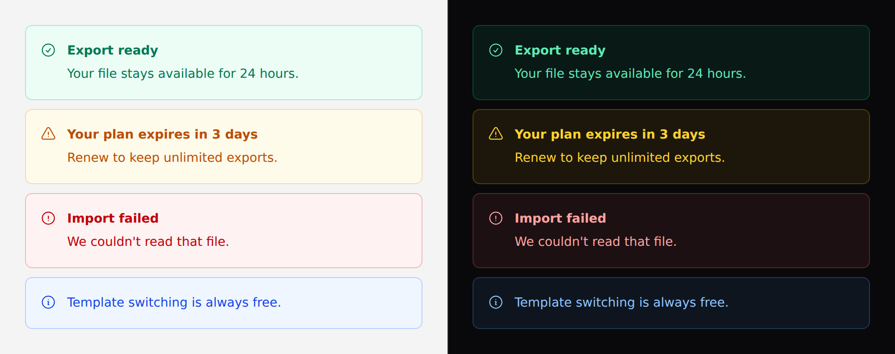

# Alert

A block that tells the reader something about **the page they are on**.



Not a [toast](toast.md): a toast floats over the page and is dismissed by time,
an alert sits in the flow next to the thing it is about and stays until the
reason is gone.

## Use it

```blade
<x-ds::alert tone="danger" title="Import failed">
    We couldn't read that file. Try a text-based export rather than a scan.
</x-ds::alert>
```

## Props

| Prop | Type | Default | What it does |
|---|---|---|---|
| `tone` | `accent` `success` `warning` `danger` | `accent` | What kind of news it is. |
| `title` | string | — | Bold first line. Omit for the single-line form. |
| `icon` | string | tone's default | Override the leading Heroicon. |
| `dismissible` | bool | `false` | Adds a close control. |

Each tone brings its own icon, so the common case needs no `icon`.

> **`tone` resolve to classes on the server.** They are chosen when the view
> renders, so binding it to Alpine state does nothing — `::tone="…"` sets an
> attribute nothing reads. To change it in the browser, bind the classes yourself
> with Alpine's **object** syntax, or re-render server-side. See
> [Driving components from client-side state](../getting-started.md#driving-components-from-client-side-state).

## One sentence needs no title

A title that restates the sentence below it is two copies of the same message.

```blade
<x-ds::alert>Template switching is always free — it never costs credits.</x-ds::alert>
```

## `dismissible` is only for what can be ignored

**A blocking error has no dismiss.** Dismissing it hides the reason the thing
they asked for did not happen, and the reader is left looking at a page that
simply did not do what they said.

The rule of thumb: if the alert is the **answer** to something the reader did,
it is not dismissible. If it is context they did not ask for, it may be.

> `dismissible` needs no JavaScript — the close control uses a plain handler, so
> an alert works in a page with no Alpine and no Livewire.

## Accessibility

`role` follows the tone, and this is the whole point of the component:

- **`danger` gets `role="alert"`** — assertive. It interrupts whatever the screen
  reader is saying, which is right for a failure.
- **Everything else gets `role="status"`** — polite. It waits its turn.

Interrupting is rude for a confirmation. A `role="alert"` on every success
message means a reader cannot finish a sentence while the page is going well.

**A live region only announces content that arrives after it is in the DOM.** An
alert rendered with the page is read in normal document order, not announced —
which is correct for a server-rendered validation summary. To *announce* one,
insert the element; do not render it hidden and reveal it.

## Don't

- **Don't stack alerts.** Three alerts is a page with no message.
- **Don't use one for field validation.** That is the `error` prop on
  [input](input.md), which wires the message to the control itself.
- **Don't use `danger` for a warning.** `alert` interrupts — spend it on failures.
- **Don't put a form or a menu inside one.** A live region announces its whole
  contents when it changes.

More in [specs/alert.md](../../specs/alert.md).
