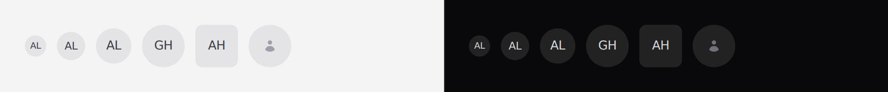

# Avatar

A person or a thing, at a glance. An image when there is one, initials when
there is not.



## Use it

```blade
<x-ds::avatar :name="$user->name" :src="$user->avatar_url" />
<x-ds::avatar name="Ada Lovelace" size="sm" />
```

## Props

| Prop | Type | Default | What it does |
|---|---|---|---|
| `name` | string | — | Supplies the initials and the accessible name. |
| `src` | string | — | Image URL. Without one, the initials are the avatar. |
| `size` | `xs` `sm` `md` `lg` | `md` | 24 / 32 / 40 / 48px. |
| `square` | bool | `false` | For a company, project or file. |
| `decorative` | bool | `false` | Hides it from screen readers. |

`sm` (32px) matches the small control height, so an avatar sits level with a
small button in a table row without a nudge.

## Round or square

Round is a **person**. `square` is a **company, a project or a file** — a circle
reads as a person, and a logo in a circle gets its corners eaten.

## Initials

Taken from the **first and last** word, so "Ada King Lovelace" is AL — the middle
name is the part nobody uses. Multi-byte names are handled correctly.

With neither `src` nor `name`, it renders a placeholder mark rather than an
empty circle.

## Accessibility

**Use `decorative` whenever the name is written next to the avatar** — which is
most of the time. A row that announces "Ada Lovelace, Ada Lovelace" is worse
than one that announces it once.

```blade
<span class="flex items-center gap-3">
    <x-ds::avatar :name="$user->name" :decorative="true" size="sm" />
    <span>{{ $user->name }}</span>
</span>
```

## Don't

- **Don't use it as a button.** Wrap it in one.
- **Don't derive the colour from the name.** A hash-to-hue avatar is nine
  unmanaged colours arriving through the back door.
- **Don't add a status dot here.** Compose one in the layout that knows what
  "online" means.

More in [specs/avatar.md](../../specs/avatar.md).
