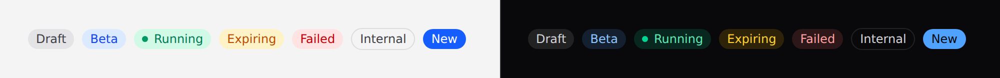

# Badge

A small label that **annotates** something — a status, a count, a category.



## Use it

```blade
<x-ds::badge tone="success">Active</x-ds::badge>
<x-ds::badge tone="warning" :dot="true">Running</x-ds::badge>
```

## Props

| Prop | Type | Default | What it does |
|---|---|---|---|
| `tone` | `neutral` `accent` `success` `warning` `danger` | `neutral` | What state it reports. |
| `variant` | `tint` `solid` `outline` | `tint` | How loud it is. |
| `dot` | bool | `false` | Leading status dot. |

> **`tone` and `variant` resolve to classes on the server.** They are chosen when the view
> renders, so binding either to Alpine state does nothing — `::tone="…"` sets an
> attribute nothing reads. To change one in the browser, bind the classes yourself
> with Alpine's **object** syntax, or re-render server-side. See
> [Driving components from client-side state](../getting-started.md#driving-components-from-client-side-state).

## Tone is a claim about state

`success` means the thing succeeded — not that it is green. Five tones exist and
there is no sixth: a feature that wants its own colour wants an icon.

An unknown tone falls back to `neutral` rather than rendering unpainted.

## Variants

**`tint` is the default because a badge annotates, it does not act.** A row of
eight solid badges in a table turns the table into the badge column. Use `solid`
for the one badge that must beat everything around it, and `outline` — which
carries no tone at all — for "this is a category, not a status".

## The dot

Use it when the badge reports something **live**: a job that is running, a
connection that is up. Not on a category.

It is `aria-hidden`, because the label already says the state. A badge whose
meaning is *only* the dot is a broken badge.

## Examples

In a table cell, keep it from wrapping:

```blade
<x-ds::table-cell :nowrap="true">
    <x-ds::badge :tone="$user->verified ? 'success' : 'warning'">
        {{ $user->verified ? 'Verified' : 'Unverified' }}
    </x-ds::badge>
</x-ds::table-cell>
```

## Accessibility

- It is a `<span>` with no role — it is not a control and not a landmark.
- **Colour is never the only carrier**: every badge has a label. That is why
  there is no icon-only variant.
- A badge that changes to report an event does **not** announce itself. Use an
  [alert](alert.md) or a [toast](toast.md) for that.

## Don't

- **Don't put a click handler on it.** If it does something it is a button; if it
  goes somewhere it is a link. A pressable badge has no focus ring and no
  keyboard access.
- **Don't put one in a heading.** The line box is set by the heading and the badge
  floats off its baseline.

More in [specs/badge.md](../../specs/badge.md).
