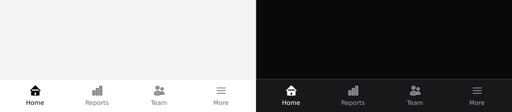

# Bottom nav

The phone's primary navigation. Covers `bottom-nav` and `bottom-nav-item`.



Fixed to the bottom **below the `lg` breakpoint**, hidden above it — where the
[sidebar](nav-item.md) takes over.

## Use it

```blade
<x-ds::bottom-nav>
    <x-ds::bottom-nav-item href="/" label="Home" :active="request()->is('/')">
        <x-slot:icon><x-ds::icon name="home" size="6" /></x-slot:icon>
    </x-ds::bottom-nav-item>

    <x-ds::bottom-nav-item href="/reports" label="Reports">
        <x-slot:icon><x-ds::icon name="chart-bar" size="6" /></x-slot:icon>
    </x-ds::bottom-nav-item>

    {{-- no href: a button, because it opens a sheet rather than navigating --}}
    <x-ds::bottom-nav-item label="More" @click="moreOpen = true">
        <x-slot:icon><x-ds::icon name="bars-3" size="6" /></x-slot:icon>
    </x-ds::bottom-nav-item>
</x-ds::bottom-nav>
```

## Props

| Component | Prop | Default | What it does |
|---|---|---|---|
| `bottom-nav` | `hidden` | `false` | Hides the bar entirely. |
| `bottom-nav-item` | `label` | *required* | Always visible. |
| `bottom-nav-item` | `href` | — | Renders `<a>`; without it, `<button>`. |
| `bottom-nav-item` | `active` | `false` | Sets `aria-current="page"`. |

Plus an `icon` slot on the item.

## Your page must reserve room

**A fixed bar cannot push content**, so the bar sits over whatever is behind it.
Pad your content area by the bar's height:

```blade
<main class="pb-16 lg:pb-0">…</main>
```

Padding, not margin — a margin on the last child collapses and the final row of
every scrolling list ends up behind the bar.

The component cannot do this for you: it does not know what it is fixed over.

## Five items, maximum

Below five the targets are comfortable; above five they are not. The fifth
should be a "More" button that opens a [sheet](sheet.md).

## Notch safety

The bar carries `safe-area-bottom`, which pads for the home indicator on a
notched phone. Without it the last few pixels of every tab are untappable while
the tabs look completely normal.

## Don't

- **Don't put an action in it.** It is navigation. A create action belongs in the
  FAB — `<x-ds::button size="fab">` — which overlaps the bar rather than sitting
  in it.
- **Don't show it above `lg`.** The sidebar owns that breakpoint.
- **Don't nest it inside a container with a `transform`.** A `transform` ancestor
  becomes the containing block for `fixed`, and the bar scrolls away with the
  content.

More in [specs/bottom-nav.md](../../specs/bottom-nav.md).
