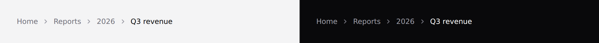

# Breadcrumb

Where this page sits. Covers `breadcrumb` and `breadcrumb-item`.



## Use it

```blade
<x-ds::breadcrumb>
    <x-ds::breadcrumb-item href="/">Home</x-ds::breadcrumb-item>
    <x-ds::breadcrumb-item href="/reports">Reports</x-ds::breadcrumb-item>
    <x-ds::breadcrumb-item :current="true">{{ $report->name }}</x-ds::breadcrumb-item>
</x-ds::breadcrumb>
```

Separators are added automatically — the first item's is hidden, so you never
pass an index or a "first" flag.

## Props

| Component | Prop | Default | What it does |
|---|---|---|---|
| `breadcrumb` | `label` | `Breadcrumb` | The landmark's name. |
| `breadcrumb-item` | `href` | — | Makes it a link. |
| `breadcrumb-item` | `current` | `false` | The page you are on. |

## The current page is text, not a link

**A link to the page you are on is a promise of somewhere to go that goes
nowhere**, and it takes a tab stop to do it. `current` renders a `<span>` with
`aria-current="page"`; an item with no `href` is treated the same way.

## Don't

- **Don't build it from URL segments.** `/reports/2` is not "2" — the crumb needs
  the record's name, and the route cannot supply it.
- **Don't collapse the middle with an ellipsis** unless those crumbs are reachable
  some other way. A hidden crumb is a lost exit.
- **Don't put actions in it.** It says where you are, not what you can do.

More in [specs/breadcrumb.md](../../specs/breadcrumb.md).
