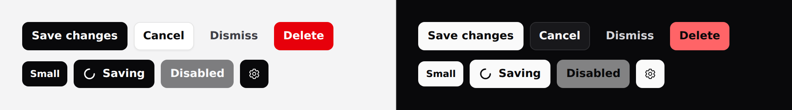

# Button

Does something, or goes somewhere.



## Use it

```blade
<x-ds::button>Save changes</x-ds::button>
<x-ds::button variant="secondary">Cancel</x-ds::button>
<x-ds::button href="/reports">View reports</x-ds::button>
```

## Props

| Prop | Type | Default | What it does |
|---|---|---|---|
| `variant` | `primary` `secondary` `ghost` `danger` | `primary` | How loud it is. |
| `size` | `sm` `md` `lg` `fab` | `md` | See sizes below. |
| `href` | string | — | Renders an `<a>` instead of a `<button>`. |
| `iconOnly` | bool | `false` | Square, no label. Needs `aria-label`. |
| `loading` | bool | `false` | Spinner, and blocks re-clicks. |
| `disabled` | bool | `false` | |
| `pill` | bool | `false` | Fully rounded. |

Anything else you pass — `type`, `wire:click`, `@click`, `class` — goes straight
through to the element.

> **`variant` and `size` resolve to classes on the server.** They are chosen when the view
> renders, so binding either to Alpine state does nothing — `::variant="…"` sets an
> attribute nothing reads. To change one in the browser, bind the classes yourself
> with Alpine's **object** syntax, or re-render server-side. See
> [Driving components from client-side state](../getting-started.md#driving-components-from-client-side-state).

## Variants

Exactly **one `primary` per view.** If two things are equally important, neither
is primary. `danger` is for destroying something, not for anything urgent.

## Sizes

`md` is **responsive**: 44px below the `sm` breakpoint, 36px above it. That is
what gives you a proper touch target on a phone without a separate mobile
button. Reach for `lg` only when you want 44px on a desktop too.

`fab` is the 56px mobile floating action button — always icon-only in practice,
but it is this component rather than a separate one, so it gets the same fill,
hover and focus ring.

## Examples

**Anything that navigates should be a link.** Pass `href` and you get an `<a>`,
which means middle-click, "open in new tab" and the status bar all work:

```blade
<x-ds::button href="/reports/{{ $report->id }}">Open report</x-ds::button>
```

**Icon-only needs a name.** There is no visible label, so give it one:

```blade
<x-ds::button iconOnly aria-label="Delete report" variant="danger">
    <x-ds::icon name="trash" size="4" />
</x-ds::button>
```

**Loading blocks the second submit.** A second click while the first request is
in flight is the bug this state exists to prevent:

```blade
<x-ds::button :loading="$saving" wire:click="save">Save</x-ds::button>
```

It stays at **full contrast** on purpose. Fading it would make "working" look
like "disabled", and those mean opposite things — one is temporary, the other is
a refusal.

**With an icon**, put the icon in the slot; the gap is handled:

```blade
<x-ds::button variant="secondary">
    <x-ds::icon name="arrow-down-tray" size="4" />
    Export
</x-ds::button>
```

## Accessibility

- A bare `<button>` defaults to `type="submit"`. This component sets
  `type="button"` instead — which is how a "Cancel" button stops saving the form
  it sits in. Pass `type="submit"` explicitly when you mean it.
- `loading` and `disabled` both set `aria-disabled`; `loading` adds `aria-busy`.
- The focus ring is `focus-visible` only, so a mouse click leaves no ring behind.

## Don't

- **Don't use `href` and a click handler together.** Pick one; a link that
  intercepts its own navigation breaks the browser's affordances.
- **Don't put two primaries side by side.**
- **Don't use `danger` for "important".** It means destructive.
- **Don't omit `aria-label` on `iconOnly`.** It is the entire accessible name.

The reasoning behind the sizes and the padding maths is in
[specs/button.md](../../specs/button.md).
