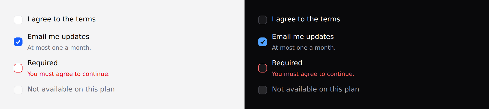

# Checkbox

One independent yes/no. Not one of a set — that is [radio](radio.md).



> `indeterminate` is the one prop here that needs
> [Alpine](../getting-started.md#alpine). Everything else on this page works in a
> plain Blade view with no JavaScript at all.

## Use it

```blade
<x-ds::checkbox name="terms" label="I agree to the terms" />
```

## Props

| Prop | Type | Default | What it does |
|---|---|---|---|
| `label` | string | *required* | The clickable label. |
| `help` | string | — | Guidance under the label. |
| `error` | string | — | Validation message. |
| `checked` | bool | `false` | |
| `indeterminate` | bool | `false` | The "some children are checked" state. |
| `disabled` | bool | `false` | |

`name`, `value`, `wire:model` and anything else pass through to the input.

## The label is the touch target

`label` is required and renders a real `<label for>`, so **its whole width is
clickable**. On a phone that is most of the target — the 18px box on its own is
well under the 44px minimum.

## Examples

**With Laravel validation:**

```blade
<x-ds::checkbox
    name="terms"
    label="I agree to the terms"
    :checked="old('terms')"
    :error="$errors->first('terms')"
/>
```

**A "select all" that reflects a partial selection:**

```blade
<x-ds::checkbox
    name="all"
    label="Select all"
    :checked="$allSelected"
    :indeterminate="$someSelected && ! $allSelected"
/>
```

`indeterminate` is a DOM property with no attribute form, so the component sets
it with `x-init` — which needs Alpine and an `x-data` scope above it. Without
one the box renders **unchecked**, which is exactly what a screen reader
announces: the feature is absent rather than lying about the state.

## Accessibility

- The real `<input type="checkbox">` is styled with `appearance-none`, not
  replaced by a decorated `<span>`. That keeps the browser's focus behaviour and
  Windows high-contrast rendering, both of which the substitution trick loses
  invisibly.
- `error` sets `aria-invalid` and wires `aria-describedby`.
- `disabled` uses the real attribute, so the field genuinely does not submit.

## Don't

- **Don't use one for a two-way choice.** "Send as HTML / Send as plain text" is
  a radio pair; a checkbox makes the reader work out what unchecked means.
- **Don't use it as a switch.** A switch applies immediately; a checkbox is
  submitted. If it takes effect on click it needs a different control.
- **Don't rely on a table column header as the label.** The header is not
  programmatically associated, and the touch target collapses to 18px.
- **Don't attach a group-level error to one checkbox.** See [radio](radio.md).

More in [specs/checkbox.md](../../specs/checkbox.md).
