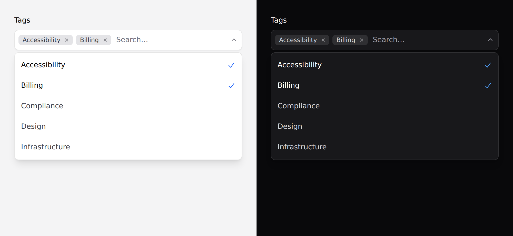

# Combobox

A select with a text filter. Multi-select is a **mode** of it.



> **Needs Alpine.** See [getting started](../getting-started.md#alpine).

## Use it

```blade
<x-ds::combobox
    name="country"
    label="Country"
    :options="$countries"
    :value="old('country', $user->country)"
/>
```

Pick several by adding `:multiple="true"` — chosen values become removable chips
inside the field:

```blade
<x-ds::combobox name="tags" label="Tags" :options="$tags" :value="$selected" :multiple="true" />
{{-- posts tags[]=a11y&tags[]=billing --}}
```

## Props

| Prop | Type | Default | What it does |
|---|---|---|---|
| `name` | string | *required* | Submitted field name. `[]` is appended for you when `multiple`. |
| `options` | array | `[]` | `value => label`. The whole list — filtering is client-side. |
| `value` | string\|array | — | Selected value, or an array of them. |
| `label` | string | — | Field label. |
| `multiple` | bool | `false` | Pick several. |
| `placeholder` | string | `Search…` | |
| `emptyText` | string | `No matches` | Shown when the filter matches nothing. |
| `help` | string | — | |
| `error` | string | — | |
| `disabled` | bool | `false` | |

## Which control

| Options | Reach for |
|---|---|
| under ~15, one choice | [select](select.md) |
| under ~12, several choices | a list of [checkboxes](checkbox.md) — more scannable, and free |
| more than that, or unfamiliar values | **this** |

A combobox costs the reader a decision before they can act: they have to guess
what to type. Below about fifteen options a plain list is faster, and on a phone
the native `<select>` is faster still.

## Filtering is client-side

You pass the whole list and the browser filters it. There is **no server-side
search** — that needs a request, and a request needs a backend contract this
system deliberately doesn't have.

For a list too large to send down, you want a different component than this one.

## Keyboard

Typing filters. Arrows walk the **filtered** list, Home and End jump, Enter and
Space choose, Escape closes.

**Backspace on an empty query removes the last chip** — without it, undoing a
selection means aiming at a 12px ✕, which on a touch screen isn't a target.

## With validation

```blade
<x-ds::combobox
    name="country"
    label="Country"
    :options="$countries"
    :value="old('country')"
    :error="$errors->first('country')"
    help="Where the invoice is issued from."
/>
```

## Don't

- **Don't use it under fifteen options.** See the table above.
- **Don't use it for actions.** A menu of verbs is a [dropdown](dropdown.md).
- **Don't expect server-side filtering.**
- **Don't use `multiple` where the total is unbounded.** Twenty chips wrap the
  field to four lines and shove the page around.

More in [specs/combobox.md](../../specs/combobox.md).
