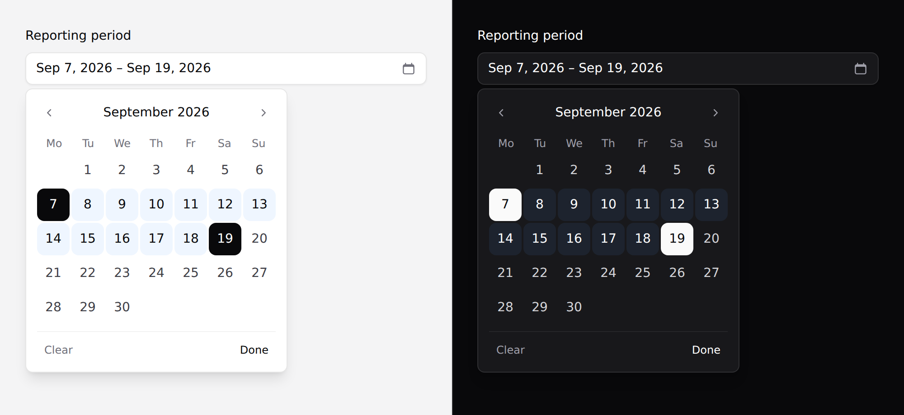

# Date picker

A calendar popover for one date or a range.



> **Needs Alpine.** See [getting started](../getting-started.md#alpine).

## The native field may be what you want

`<x-ds::input type="date" />` gives the platform's own date field. **On anything
phone-first that is the better control** — the OS picker is a wheel the reader
already knows, it's localised, and it costs nothing.

This component exists because the native popup can't be styled.

## Use it

```blade
<x-ds::date-picker name="due" label="Due date" :value="old('due', $task->due_at)" />
{{-- posts due=2026-09-30 --}}
```

A range posts **two fields**:

```blade
<x-ds::date-picker name="period" label="Reporting period" :range="true"
                   :value="[$from, $to]" :min="now()->subYear()" :max="now()" />
{{-- posts period_start=2026-07-01 and period_end=2026-09-30 --}}
```

Two dates are two values — squeezing them into one string means every project
writing the same parser and getting the separator wrong.

## Props

| Prop | Type | Default | What it does |
|---|---|---|---|
| `name` | string | *required* | Field name. With `range`, posts `{name}_start` / `{name}_end`. |
| `value` | date\|array | — | `Y-m-d`, a `DateTimeInterface`, or an array of two for a range. |
| `range` | bool | `false` | Pick a start and an end. |
| `min` / `max` | date | — | Earliest / latest selectable day. |
| `label` | string | — | |
| `placeholder` | string | `Choose a date` | |
| `weekStartsOn` | `0` \| `1` | `1` | Sunday or Monday. |
| `help` | string | — | |
| `error` | string | — | |
| `disabled` | bool | `false` | |

`value` accepts a Carbon instance directly, so `$task->due_at` works with no
formatting on your side.

## Reading it back

The posted value is `Y-m-d`, which is what a date column and `Carbon::parse` both
want:

```php
$request->validate([
    'period_start' => ['required', 'date'],
    'period_end'   => ['required', 'date', 'after_or_equal:period_start'],
]);

$from = Carbon::parse($request->period_start);
```

## Keyboard

Arrows move a day, **PageUp/PageDown a month**, Home/End the ends of it. Moving
past the edge of the month follows the grid — it changes month and keeps focus on
the day it landed on.

A calendar that only answers to Tab makes a keyboard reader press it thirty times
to reach the end of the month.

## Range behaviour

First click sets the start, second sets the end. **A second click *before* the
start re-opens the range from there** rather than producing a backwards range you
then have to undo — that's the interaction people hit when they misread the
calendar, and it should cost nothing.

While a range is half-made, hovering previews it.

## Locale

Day and month names come from Carbon, so they follow `config('app.locale')`. The
summary in the trigger is formatted in the browser, so it follows the *reader's*
locale.

`weekStartsOn` is a prop because which day a week starts on is regional, and no
default is right everywhere.

## Don't

- **Don't use it on a phone-first screen.** See the top of this page.
- **Don't use it for a date of birth.** A hundred-year calendar is thirteen hundred
  presses of "previous month" — that wants three selects or a text field.
- **Don't add a time to it.** A date and a time are two questions.
- **Don't put it at the bottom of a page** without checking it fits. No popover in
  this system does collision detection.

More in [specs/date-picker.md](../../specs/date-picker.md), including why every
value here is a string rather than a `Date`.
