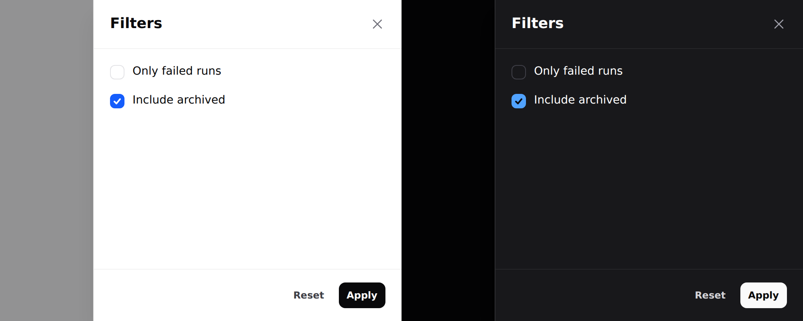

# Drawer

A panel that slides in from the edge and blocks the page behind it.



> **Needs Alpine.** See [getting started](../getting-started.md#alpine).

## Use it

```blade
<div x-data="{ filtersOpen: false }">
    <x-ds::button variant="secondary" @click="filtersOpen = true">Filters</x-ds::button>

    <x-ds::drawer open="filtersOpen" title="Filters" side="right" size="sm">
        <div class="flex flex-col gap-3">
            <x-ds::checkbox name="failed" label="Only failed runs" />
            <x-ds::checkbox name="archived" label="Include archived" />
        </div>

        <x-slot:footer>
            <x-ds::button variant="ghost" size="sm" @click="filtersOpen = false">Reset</x-ds::button>
            <x-ds::button size="sm">Apply</x-ds::button>
        </x-slot:footer>
    </x-ds::drawer>
</div>
```

## Props

| Prop | Type | Default | What it does |
|---|---|---|---|
| `open` | Alpine expression | *required* | The boolean **you** declare. |
| `title` | string | — | Heading, and the dialog's accessible name. |
| `side` | `right` `left` | `right` | Which edge it enters from. |
| `size` | `sm` `md` `lg` | `md` | Max width. Full width on a phone. |
| `dismissible` | bool | `true` | Backdrop click, Escape, close button. |

Plus a `footer` slot.

## Which side

**Right for filters and detail** — it is where the reader's attention already is
after they clicked something on the right. **Left for navigation**, because that
is where navigation lives.

## Modal or drawer

The tell is **how long the reader stays**. A [modal](modal.md) is *answered*; a
drawer is *worked in*, then closed.

A drawer holding one yes/no question wastes the whole height of the screen on
it. A modal holding twelve filters scrolls.

## What you get for free

Same contract as the modal: focus moves in and returns to the trigger, Tab is
trapped both ways, Escape closes, the page behind does not scroll, and the
**body** scrolls while the header and footer stay put — which matters most for a
long filter list, exactly where losing the Apply button off the bottom hurts.

## Don't

- **Don't open a drawer from a drawer.**
- **Don't use one for navigation above `lg`.** That is the sidebar.
- **Don't put the submit in the scrolling body.** That is what `footer` is for.

More in [specs/drawer.md](../../specs/drawer.md).
