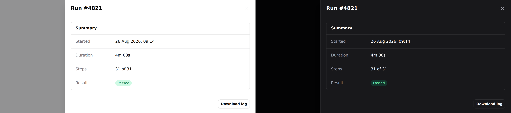

# Drawer

A panel that slides in from the edge and blocks the page behind it.


> **Needs Alpine.** See [getting started](../getting-started.md#alpine).

## Use it

```blade
<div x-data="{ filtersOpen: false }">
    <x-ds::button variant="secondary" @click="filtersOpen = true">Filters</x-ds::button>

    <x-ds::drawer open="filtersOpen" title="Filters" side="right" size="sm">
        <div class="flex flex-col gap-3">
            <x-ds::checkbox name="failed" label="Only failed runs" />
            <x-ds::checkbox name="archived" label="Include archived" />
        </div>

        <x-slot:footer>
            <x-ds::button variant="ghost" size="sm" @click="filtersOpen = false">Reset</x-ds::button>
            <x-ds::button size="sm">Apply</x-ds::button>
        </x-slot:footer>
    </x-ds::drawer>
</div>
```

## Props

| Prop | Type | Default | What it does |
|---|---|---|---|
| `open` | Alpine **reference** | *required* | The boolean **you** declare. Must be assignable — see below. |
| `title` | string | — | Heading, and the dialog's accessible name. |
| `side` | `right` `left` | `right` | Which edge it enters from. |
| `size` | `sm` `md` `lg` `xl` `2xl` `full` | `md` | Max width. Full width on a phone, at every size. |
| `dismissible` | bool | `true` | Backdrop click, Escape, close button. |

Plus a `footer` slot.

## `open` is a reference, not a condition

The component reads `open` *and writes `false` back to it* from the close button,
the backdrop and Escape, so it has to be something JavaScript can assign to. The
natural way to drive two drawers from one variable is the way that breaks:

```blade
{{-- Broken: opens, and then nothing closes it --}}
<div x-data="{ side: null }">
    <x-ds::button @click="side = 'right'">Filters</x-ds::button>
    <x-ds::drawer open="side === 'right'" title="Filters">…</x-ds::drawer>
</div>

{{-- Works: one property per panel --}}
<div x-data="{ show: { right: false, left: false } }">
    <x-ds::button @click="show.right = true">Filters</x-ds::button>
    <x-ds::drawer open="show.right" title="Filters">…</x-ds::drawer>
</div>
```

The broken form compiles to `side === 'right' = false`. Reading it is fine, so
the drawer **opens correctly**, and then the ✕, the backdrop and Escape all do
nothing — clean server log, one `Invalid left-hand side in assignment` in the
browser console. Since v1.1 that throws at render time instead.

## Sizes

`sm` through `lg` are filter-panel widths and the common case. `xl` and `2xl`
are for a drawer used to **read** a record rather than filter one — a detail pane
beside the list it came from.

```blade
<x-ds::drawer open="show.detail" size="2xl" title="Run #4821">
    <x-ds::panel title="Summary">…</x-ds::panel>
</x-ds::drawer>
```



Note the strip of page still visible behind it. That is the difference between a
wide drawer and a new screen, and it is why `full` stops 3rem short.

`full` is `calc(100vw - 3rem)`, not edge to edge. The strip of page still showing
behind it is what keeps it reading as a drawer rather than a new screen — if you
want the whole viewport, you want a page.

## Which side

**Right for filters and detail** — it is where the reader's attention already is
after they clicked something on the right. **Left for navigation**, because that
is where navigation lives.

## Modal or drawer

The tell is **how long the reader stays**. A [modal](modal.md) is *answered*; a
drawer is *worked in*, then closed.

A drawer holding one yes/no question wastes the whole height of the screen on
it. A modal holding twelve filters scrolls.

## What you get for free

Same contract as the modal: focus moves in and returns to the trigger, Tab is
trapped both ways, Escape closes, the page behind does not scroll, and the
**body** scrolls while the header and footer stay put — which matters most for a
long filter list, exactly where losing the Apply button off the bottom hurts.

## Don't

- **Don't drive several drawers from one variable.** `open="side === 'right'"`
  is not assignable: it opens and then ignores every way of closing. See above.
- **Don't open a drawer from a drawer.**
- **Don't use one for navigation above `lg`.** That is the sidebar.
- **Don't put the submit in the scrolling body.** That is what `footer` is for.

More in [specs/drawer.md](../../specs/drawer.md).
