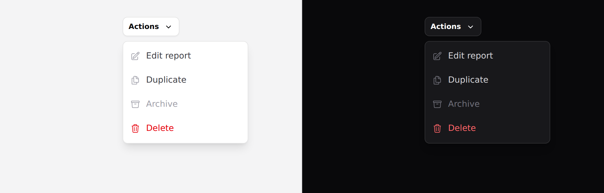

# Dropdown

A menu of actions anchored to the control that opened it. Covers `dropdown` and
`dropdown-item`.



> **Needs Alpine.** See [getting started](../getting-started.md#alpine).

## Use it

**`open` is optional here** — leave it off and the menu scopes its own state, so
a kebab menu on every row of a table needs no wrapper:

```blade
<x-ds::dropdown>
    <x-slot:trigger>
        <x-ds::button variant="secondary" size="sm">
            Actions <x-ds::icon name="chevron-down" variant="mini" size="4" />
        </x-ds::button>
    </x-slot:trigger>

    <x-ds::dropdown-item icon="pencil-square" href="/edit">Edit report</x-ds::dropdown-item>
    <x-ds::dropdown-item icon="document-duplicate" href="/duplicate">Duplicate</x-ds::dropdown-item>
    <x-ds::dropdown-item icon="trash" tone="danger" as="button">Delete</x-ds::dropdown-item>
</x-ds::dropdown>
```

Pass `open="menuOpen"` when something else also needs to open it.

## `dropdown` props

| Prop | Type | Default | What it does |
|---|---|---|---|
| `open` | Alpine expression | — | Omit to let it scope its own state. |
| `placement` | `bottom-end` `bottom-start` `top-start` `top-end` | `bottom-end` | Which corner it hangs from. |

Plus a `trigger` slot.

## `dropdown-item` props

| Prop | Type | Default | What it does |
|---|---|---|---|
| `icon` | string | — | Leading Heroicon. |
| `href` | string | — | Makes it a link. |
| `tone` | `neutral` `danger` | `neutral` | Two tones only. |
| `as` | string | — | `button` forces `type="submit"`. |
| `disabled` | bool | `false` | |

## Not a select

A dropdown holds **verbs**. A [select](select.md) holds **values** — it is a form
field and it posts something.

The tell is what happens on click: an item that *does* something is a menu item;
an item that *becomes the field's value* is an option.

## Placement

`bottom-end` is the default because the overwhelming case is a trigger on the
right of a row, where a left-aligned menu runs off the page.

**There is no collision detection.** The component does not know where the
viewport edge is — a menu near the bottom of the page needs `placement="top-*"`
from you.

## The trigger is your element

Put whatever you like in the `trigger` slot. The component finds the button or
link inside it and keeps `aria-haspopup` and `aria-expanded` on it, so a screen
reader is told the button owns a menu and whether it is open.

## Keyboard

**Arrow keys move between items; Home and End jump to the ends.** Disabled items
are skipped, not merely dimmed. Focus enters the first enabled item on open and
returns to the trigger on close. Escape closes; Tab closes and moves on.

## Don't

- **Don't put a form in it.** Click-outside and Escape will discard what the
  reader typed, with no warning.
- **Don't nest a submenu.** There is no hover intent and no keyboard way back out.
- **Don't use it for primary navigation.** That is [nav-item](nav-item.md) —
  navigation should not be hidden.
- **Don't build a select out of it.**

More in [specs/dropdown.md](../../specs/dropdown.md).
