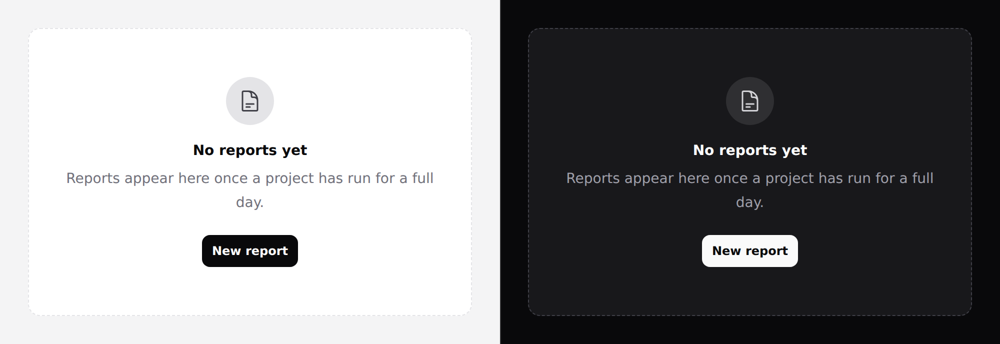

# Empty state

What a region says when it has nothing in it.



## Use it

```blade
<x-ds::empty-state
    title="No reports yet"
    description="Reports appear here once a project has run for a full day."
    icon="document-text"
>
    <x-slot:action>
        <x-ds::button size="sm" href="/reports/new">New report</x-ds::button>
    </x-slot:action>
</x-ds::empty-state>
```

## Props

| Prop | Type | Default | What it does |
|---|---|---|---|
| `title` | string | *required* | What is not here. |
| `description` | string | — | Why, or what to do about it. |
| `icon` | string | — | Heroicon for the mark above the title. |
| `tone` | `neutral` `accent` `success` `warning` `danger` | `neutral` | Tone of that mark. |
| `bare` | bool | `false` | Drops the border and padding. |

Plus an `action` slot.

## The button goes in `action`, and there is no default slot

`empty-state` is the one component in the system whose body is *props* rather
than a slot: the words are `title` and `description`, and the button is the named
`action` slot.

```blade
{{-- Broken: renders nothing, and used to say nothing about it --}}
<x-ds::empty-state title="No reports yet">
    <x-ds::button>New report</x-ds::button>
</x-ds::empty-state>

{{-- Works --}}
<x-ds::empty-state title="No reports yet">
    <x-slot:action>
        <x-ds::button>New report</x-ds::button>
    </x-slot:action>
</x-ds::empty-state>
```

Every other component here treats its default slot as the body, so passing the
button there is the reasonable guess — and an anonymous Blade component simply
**drops** content it never renders. No error, no button, HTTP 200: an empty state
missing the one control that would fix the emptiness.

Since v1.1 that throws instead of rendering nothing.

## Writing one

The parts are mostly a writing problem:

- **Title** — what is not here, in the reader's words. "No reports yet", not
  "Empty" and not "No data".
- **Description** — why, or what to do. One sentence. If there is nothing useful
  to say, leave it out rather than restating the title.
- **Action** — the thing that ends the emptiness. If the reader genuinely cannot
  act (no permission, nothing to create), say *that* in the description.

"No results" with no way to widen the search is the most common broken one.

## Tone

**Most emptiness is the beginning, not a failure**, which is why `neutral` is the
default — a coloured mark on a brand-new account tells the reader something has
gone wrong.

Spend a tone when the emptiness has a **cause**: `accent` for a search that
matched nothing, `danger` for an import that failed.

## `bare`

For an empty state already inside a [panel](panel.md) or a [table](table.md).
Two nested frames is a box in a box, and the dashed edge starts to look like a
drop target.

## Don't

- **Don't pass the button as the default slot.** There isn't one. It belongs in
  `<x-slot:action>` — see above.

- **Don't use it for a loading state.** That is [skeleton](skeleton.md) — "nothing
  here" and "not here yet" are opposite claims.
- **Don't use it for an error with a retry.** That is an [alert](alert.md).
- **Don't put more than one action in it**, plus at most one quiet secondary.

More in [specs/empty-state.md](../../specs/empty-state.md).
