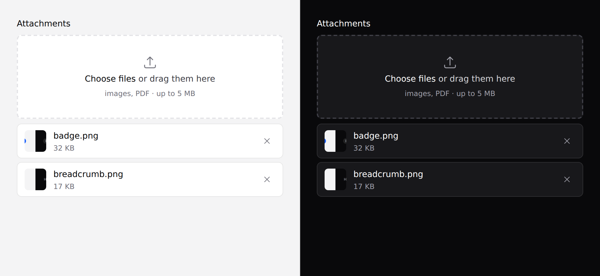

# File upload

A styled file field with drag-and-drop and local image previews.



> **It does not upload anything.** It's a real `<input type="file">`, so a plain
> form POST and `wire:model` both work unchanged. See [where the line
> is](#what-it-does-not-do).

## Use it

```blade
<form method="POST" action="/attachments" enctype="multipart/form-data">
    @csrf
    <x-ds::file-upload
        name="attachments[]"
        label="Attachments"
        :multiple="true"
        accept="image/*,.pdf"
        :maxSize="5 * 1024 * 1024"
    />
    <x-ds::button type="submit">Upload</x-ds::button>
</form>
```

**`enctype="multipart/form-data"` is yours to remember** — without it the browser
posts only filenames, and the failure looks like a broken upload rather than a
missing attribute.

## Props

| Prop | Type | Default | What it does |
|---|---|---|---|
| `name` | string | *required* | Field name. **Add `[]` yourself when `multiple`.** |
| `label` | string | — | |
| `multiple` | bool | `false` | Accept more than one file. |
| `accept` | string | — | `"image/*"`, `".pdf,.csv"`. Rendered as a human hint. |
| `maxSize` | int | — | Bytes. Checked in the browser only. |
| `preview` | bool | `true` | Thumbnail for image files, read locally. |
| `help` | string | — | |
| `error` | string | — | |
| `disabled` | bool | `false` | |

## With Livewire

```blade
<x-ds::file-upload name="photo" label="Profile photo" accept="image/*" wire:model="photo" />
```

Livewire owns the upload; the component just presents the field.

## With validation

```blade
<x-ds::file-upload
    name="contract"
    label="Signed contract"
    accept=".pdf"
    :maxSize="10 * 1024 * 1024"
    :error="$errors->first('contract')"
/>
```

**`accept` and `maxSize` are courtesies, not validation.** Both are hints to the
file dialog and both can be bypassed by dragging. Validate on the server:

```php
$request->validate(['contract' => ['required', 'mimes:pdf', 'max:10240']]);
```

## What it does not do

No progress bars, no transport. Progress needs somewhere to upload *to*, and a
component that knows that has a backend contract — which nothing else in this
system has. Livewire solves it with `wire:model`; a plain form solves it with
`<form>`.

## Don't

- **Don't forget `[]` on the name when `multiple`.** PHP keeps only the last file,
  and nothing reports it.
- **Don't rely on `accept` or `maxSize` for validation.**
- **Don't use it for an avatar that needs cropping.** That's a different component
  and it doesn't exist.

More in [specs/file-upload.md](../../specs/file-upload.md).
