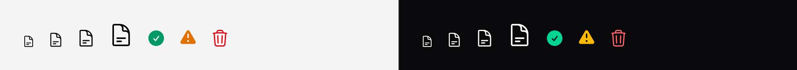

# Icon

A Heroicon, sized and coloured by the system.



## Use it

```blade
<x-ds::icon name="check-circle" />
<x-ds::icon name="trash" size="5" class="text-danger" />
```

Icons inherit `currentColor`, so they take the colour of the text around them.
Set a colour with a class when you need a different one.

## Props

| Prop | Type | Default | What it does |
|---|---|---|---|
| `name` | string | *required* | Any [Heroicons v2](https://heroicons.com) name. |
| `variant` | `outline` `solid` `mini` `micro` | `outline` | 24px outline, 24px solid, 20px, 16px. |
| `size` | Tailwind size step | `4` (16px) | `4` = 16px, `5` = 20px, `6` = 24px. |
| `label` | string | — | Makes the icon meaningful rather than decorative. |

## Size: the one thing to know

`size` builds the class `size-{$size}` at runtime, and Tailwind reads source
**text** — so `size="4.5"` in your Blade is not the string `size-4.5`.

The package pre-generates a range so this works anyway: **1.5, 3, 3.5, 4, 4.5,
5, 5.5, 6, 7, 8, 9, 10, 11, 12, 14, 16**.

Pass something outside that range and the icon gets **no rule at all**, which
means it expands to fill its container. If an icon renders enormous, this is
why. Either use a size from the list, or write the class yourself so your own
Tailwind scan picks it up:

```blade
<x-ds::icon name="check" class="size-[18px]" />
```

## Accessibility

**Icons are hidden from screen readers by default**, because most sit beside a
label that already says the same thing — "trash Delete" is worse than "Delete".

Pass `label` **only** when the icon is the only thing carrying the meaning:

```blade
{{-- decorative: the word "Delete" is right there --}}
<x-ds::button><x-ds::icon name="trash" size="4" /> Delete</x-ds::button>

{{-- meaningful: nothing else says what this does --}}
<x-ds::icon name="check-circle" label="Verified" class="text-success" />
```

For an icon-only button, put the name on the **button**, not the icon.

## Old icon names still work

Heroicons v2 renamed a lot of icons, and a renamed name resolves to nothing —
it renders blank, silently. Common v1 names (`x`, `search`, `mail`, `cog`,
`menu`, `logout`, …) are aliased to their v2 spellings.

Publish the config to see or extend the map:

```bash
php artisan vendor:publish --tag=blade-ui-config
```

New code should use v2 names.

## Don't

- **Don't label a decorative icon.** Every redundant label is one more thing read
  aloud before the reader reaches what they wanted.
- **Don't set a colour on a wrapper and expect the SVG to take it.** The icons
  carry `fill="currentColor"` as a presentation attribute, which beats
  inheritance. Put the class on the icon.

More in [specs/icon.md](../../specs/icon.md).
