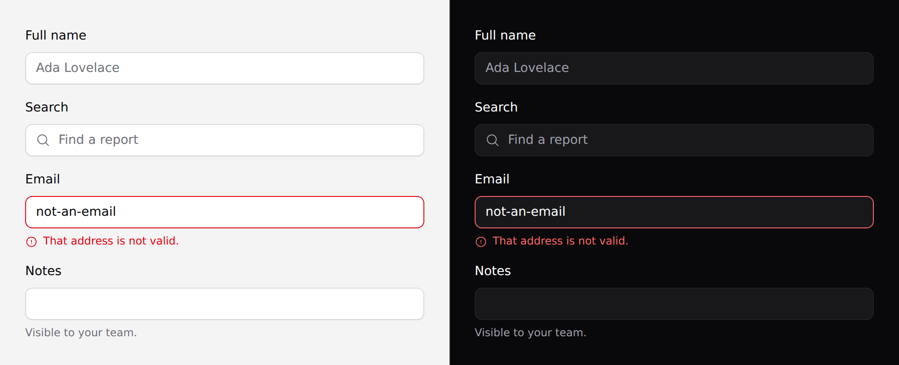

# Input

A text field, a textarea, or a native select. One component, three shapes.



## Use it

```blade
<x-ds::input name="email" label="Email address" type="email" />
<x-ds::input as="textarea" name="notes" label="Notes" :rows="4" />
<x-ds::input as="select" name="plan" label="Plan">
    <option value="free">Free</option>
    <option value="pro">Pro</option>
</x-ds::input>
```

## Props

| Prop | Type | Default | What it does |
|---|---|---|---|
| `as` | `input` `textarea` `select` | `input` | Which control to render. |
| `type` | string | `text` | Any HTML input type. Ignored for the other two. |
| `label` | string | — | Rendered as a real `<label for>`. |
| `help` | string | — | Guidance under the field. |
| `error` | string | — | Validation message. Styles the control and sets `aria-invalid`. |
| `icon` | string | — | Heroicon inside the control, before the value. |
| `rows` | int | `3` | Textarea only. |
| `disabled` | bool | `false` | |

`name`, `value`, `placeholder`, `required`, `wire:model` and anything else pass
straight through to the control.

## `help` is replaced by `error`, never stacked

Two lines of guidance under one field is one too many. Pass both and the error
wins while it is there.

```blade
<x-ds::input
    name="email"
    label="Email address"
    help="We only use this for receipts."
    :error="$errors->first('email')"
/>
```

With Laravel validation that is the whole integration — `$errors->first()`
returns `null` when the field is clean, so `help` shows until it doesn't.

## An `id` is generated if you don't give one

The label needs a `for` and the help text needs an `aria-describedby`, so the
component generates a stable id per field. Pass your own `id` when something
outside needs to point at the control.

## The select here is the native one

`as="select"` renders a real `<select>` — the OS control, with the OS popup.
**On anything phone-first that is the right choice**: it gets typeahead and the
platform's own scrolling for free.

Use [`x-ds::select`](select.md) when the unstyleable native popup is the problem.

## Accessibility

- `label` is a real `<label for>`, so clicking it focuses the field.
- `error` sets `aria-invalid="true"` and wires `aria-describedby`.
- The focus ring is drawn **inward**, so the box never changes size on focus and
  nothing below it shifts.
- Omit `label` only when a visible label elsewhere already names the field — and
  then give the control an `aria-label` yourself.

## Don't

- **Don't use a placeholder as the label.** It disappears the moment someone
  types, and it is invisible to autofill.
- **Don't put the error in an [alert](alert.md) above the form.** The reader then
  has to work out which field it meant.
- **Don't disable a field to mean "not applicable".** Hide it, or explain in
  `help` — a greyed-out field is a question with no answer.

More in [specs/input.md](../../specs/input.md).
