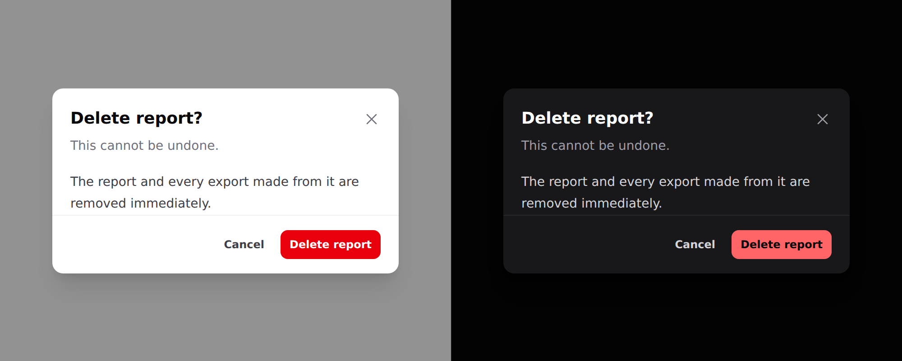

# Modal

A surface that blocks the page until the reader deals with it.



> **Needs Alpine.** See [getting started](../getting-started.md#alpine).

## Use it

```blade
<div x-data="{ confirmOpen: false }">
    <x-ds::button variant="danger" @click="confirmOpen = true">Delete report</x-ds::button>

    <x-ds::modal open="confirmOpen" title="Delete report?" description="This cannot be undone." size="sm">
        The report and every export made from it are removed immediately.

        <x-slot:footer>
            <x-ds::button variant="ghost" size="sm" @click="confirmOpen = false">Cancel</x-ds::button>
            <x-ds::button variant="danger" size="sm">Delete report</x-ds::button>
        </x-slot:footer>
    </x-ds::modal>
</div>
```

## Props

| Prop | Type | Default | What it does |
|---|---|---|---|
| `open` | Alpine expression | *required* | The boolean **you** declare. |
| `title` | string | — | Heading, and the dialog's accessible name. |
| `description` | string | — | Second line, for the "are you sure" sentence. |
| `size` | `sm` `md` `lg` `xl` | `md` | |
| `dismissible` | bool | `true` | Backdrop click, Escape, and a close button. |

Plus a `footer` slot for the actions.

## `open` is a variable name, not a value

Pass the **name** of a boolean in an Alpine scope above the modal — `"confirmOpen"`,
not `"true"`. The component reads it and writes `false` back to it when it
closes, so `open="true"` compiles to `true = false` and throws.

Anything that owns a boolean works: `x-data`, a Livewire property via
`@entangle`, or a Volt state.

## `dismissible="false"`

For a modal the reader must answer. A destructive confirm whose backdrop
dismisses it **gets dismissed by accident**, and an accidental dismissal reads as
"cancelled" — which is safe right up until it isn't.

**With `dismissible="false"` the footer must offer a way out.** A modal with no
exit is a trap, and the component cannot check that for you.

## Modal, drawer or sheet

All three block the page:

- **Modal** — a *question*. One decision, then gone.
- **[Drawer](drawer.md)** — a *workspace*. Filters, a detail panel.
- **[Sheet](sheet.md)** — the mobile form of either.

A confirmation is a modal at every width. A list of choices below `lg` is a
sheet.

## What you get for free

- Focus moves into the panel on open and **returns to the trigger** on close.
- **Tab is trapped**, both directions. No Alpine plugin needed.
- Escape closes, when `dismissible`.
- The page behind does not scroll.
- The visible title is the accessible name.
- The **body** scrolls, not the panel — so the title keeps naming the dialog and
  the footer keeps its actions reachable.

Give a field `autofocus` and focus lands there instead of the panel.

## Don't

- **Don't nest a modal in a modal.** Two blocking layers give the reader no way to
  know what Escape means.
- **Don't open a modal and a sheet together.** They share `z-50`.
- **Don't hold a workflow in one.** More than one decision belongs on a page.
- **Don't put a form's only validation errors in a modal that closes on submit.**

More in [specs/modal.md](../../specs/modal.md).
