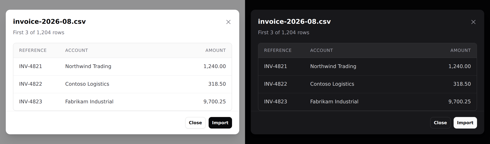

# Modal

A surface that blocks the page until the reader deals with it.


> **Needs Alpine.** See [getting started](../getting-started.md#alpine).

## Use it

```blade
<div x-data="{ confirmOpen: false }">
    <x-ds::button variant="danger" @click="confirmOpen = true">Delete report</x-ds::button>

    <x-ds::modal open="confirmOpen" title="Delete report?" description="This cannot be undone." size="sm">
        The report and every export made from it are removed immediately.

        <x-slot:footer>
            <x-ds::button variant="ghost" size="sm" @click="confirmOpen = false">Cancel</x-ds::button>
            <x-ds::button variant="danger" size="sm">Delete report</x-ds::button>
        </x-slot:footer>
    </x-ds::modal>
</div>
```

## Props

| Prop | Type | Default | What it does |
|---|---|---|---|
| `open` | Alpine **reference** | *required* | The boolean **you** declare. Must be assignable — see below. |
| `title` | string | — | Heading, and the dialog's accessible name. |
| `description` | string | — | Second line, for the "are you sure" sentence. |
| `size` | `sm` `md` `lg` `xl` `2xl` `3xl` `4xl` `full` | `md` | Max width. Full width less a gutter on a phone, at every size. |
| `dismissible` | bool | `true` | Backdrop click, Escape, and a close button. |

Plus a `footer` slot for the actions.

## `open` is a reference, not a condition

Pass the **name** of a boolean in an Alpine scope above the modal —
`"confirmOpen"`, not `"true"` and not a comparison. The component reads it *and
writes `false` back to it* from the close button, the backdrop and Escape, so it
has to be something JavaScript can assign to.

```blade
{{-- Broken: opens, and then nothing closes it --}}
<div x-data="{ mode: null }">
    <x-ds::button @click="mode = 'confirm'">Delete</x-ds::button>
    <x-ds::modal open="mode === 'confirm'" title="Delete report?">…</x-ds::modal>
</div>

{{-- Works: one property per dialog --}}
<div x-data="{ show: { confirm: false, rename: false } }">
    <x-ds::button @click="show.confirm = true">Delete</x-ds::button>
    <x-ds::modal open="show.confirm" title="Delete report?">…</x-ds::modal>
</div>
```

The broken form compiles to `mode === 'confirm' = false`. Reading it is fine, so
the modal **opens correctly**, and then the ✕, the backdrop and Escape all do
nothing — with a clean server log and one `Invalid left-hand side in assignment`
in the browser console.

Since v1.1 that throws at render time instead, naming the component and the
expression.

Anything that owns a boolean works: `x-data`, a Livewire property via
`@entangle`, or a Volt state.

## `dismissible="false"`

For a modal the reader must answer. A destructive confirm whose backdrop
dismisses it **gets dismissed by accident**, and an accidental dismissal reads as
"cancelled" — which is safe right up until it isn't.

**With `dismissible="false"` the footer must offer a way out.** A modal with no
exit is a trap, and the component cannot check that for you.

## Modal, drawer or sheet

All three block the page:

- **Modal** — a *question*. One decision, then gone.
- **[Drawer](drawer.md)** — a *workspace*. Filters, a detail panel.
- **[Sheet](sheet.md)** — the mobile form of either.

A confirmation is a modal at every width. A list of choices below `lg` is a
sheet.

## What you get for free

- Focus moves into the panel on open and **returns to the trigger** on close.
- **Tab is trapped**, both directions. No Alpine plugin needed.
- Escape closes, when `dismissible`.
- The page behind does not scroll.
- The visible title is the accessible name.
- The **body** scrolls, not the panel — so the title keeps naming the dialog and
  the footer keeps its actions reachable.

Give a field `autofocus` and focus lands there instead of the panel.

## Sizes

`sm` through `xl` cover what a dialog is usually for: a confirm, a short form.
`2xl` through `4xl` are for content whose natural measure is **horizontal** — a
table preview, a diff, a side-by-side compare, a log excerpt. `full` is the
container less its `p-4` gutter, capped at 96rem so it does not become a 2528px
dialog on a wide monitor — 348px at 380, 1408px at 1440, 1536px at 2560.

```blade
<x-ds::modal open="preview" size="3xl" title="invoice-2026-08.csv">
    <x-ds::table>…</x-ds::table>
</x-ds::modal>
```



Every size is full width less the gutter on a phone — `w-full` does that, and
`max-w-*` only caps it. Nothing extra is needed for mobile.

**Past roughly `3xl`, ask whether it wants to be a page.** Something that needs
900px of horizontal room usually also wants a URL and a back button. The widths
are here because "preview this file" is real, not because a bigger modal is a
better one.

## Don't

- **Don't give `open` a comparison.** `open="mode === 'confirm'"` opens and then
  ignores every way of closing. See above.
- **Don't nest a modal in a modal.** Two blocking layers give the reader no way to
  know what Escape means.
- **Don't open a modal and a sheet together.** They share `z-50`.
- **Don't hold a workflow in one.** More than one decision belongs on a page.
- **Don't put a form's only validation errors in a modal that closes on submit.**

More in [specs/modal.md](../../specs/modal.md).
