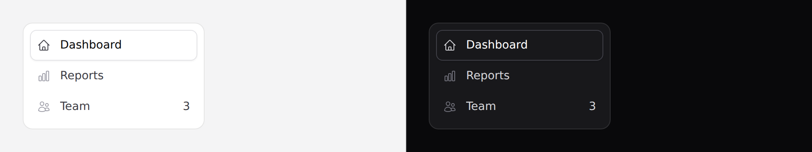

# Nav item

A row in the sidebar rail.



> `collapsedWhen` is the one prop here that needs
> [Alpine](../getting-started.md#alpine). Omit it and the component needs no
> JavaScript.

## Use it

```blade
<nav aria-label="Primary" class="rounded-panel border border-border bg-surface p-2">
    <x-ds::nav-item href="/" label="Dashboard" :active="request()->is('/')">
        <x-slot:icon><x-ds::icon name="home" /></x-slot:icon>
    </x-ds::nav-item>

    <x-ds::nav-item href="/reports" label="Reports" :active="request()->is('reports*')">
        <x-slot:icon><x-ds::icon name="chart-bar" /></x-slot:icon>
    </x-ds::nav-item>

    <x-ds::nav-item href="/team" label="Team" badge="3">
        <x-slot:icon><x-ds::icon name="users" /></x-slot:icon>
    </x-ds::nav-item>
</nav>
```

The `<nav aria-label>` around it is **yours** — the component is one row, and a
page usually has more than one navigation landmark.

## Props

| Prop | Type | Default | What it does |
|---|---|---|---|
| `href` | string | *required* | |
| `label` | string | *required* | |
| `active` | bool | `false` | Sets `aria-current="page"`. |

| `badge` | string\|int | — | Trailing count. Hidden with the label when collapsed. |
| `chip` | bool | `false` | Wraps the icon in a tinted chip. |
| `collapsedWhen` | Alpine expression | — | True when the rail is collapsed to icons. |

The icon is a **slot**, not a prop — `<x-slot:icon>`. Passing `icon="home"` as an
attribute renders no icon at all and reports nothing.

## The active item is elevation, not colour

A raised card, never a coloured fill. Colour alone would have to fight the icon
and the label for the same signal; a change of elevation reads instantly and
survives both themes without redefining anything.

## Collapsing the rail

`collapsedWhen` takes an **Alpine expression** rather than a boolean, because the
rail's collapsed state belongs to your shell — hover-to-peek, a persisted
preference, a keyboard shortcut. The component does not need to know which:

```blade
<div x-data="{ railCollapsed: false }">
    <x-ds::nav-item href="/" label="Dashboard" collapsedWhen="railCollapsed">
        <x-slot:icon><x-ds::icon name="home" /></x-slot:icon>
    </x-ds::nav-item>
</div>
```

Omit it for a permanently expanded rail — no Alpine needed.

Every item carries a `title` attribute, so a collapsed icon still has a name on
hover.

## Don't

- **Don't use it for a page's own tabs.** That is [tabs](tabs.md).
- **Don't hide primary navigation in a [dropdown](dropdown.md).**
- **Don't set `active` on more than one item.**

More in [specs/nav-item.md](../../specs/nav-item.md).
