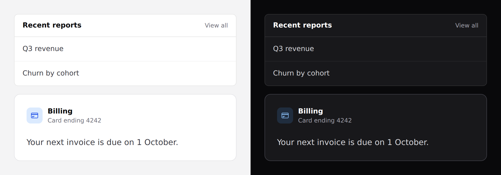

# Panel

A bordered card. Covers `panel` and `panel-row`.



## Use it

```blade
<x-ds::panel title="Recent reports" action="View all" actionHref="/reports">
    <x-ds::panel-row href="/reports/1">Q3 revenue</x-ds::panel-row>
    <x-ds::panel-row href="/reports/2">Churn by cohort</x-ds::panel-row>
</x-ds::panel>
```

## Props

| Prop | Type | Default | What it does |
|---|---|---|---|
| `title` | string | — | Panel heading. Omit for a bare bordered box. |
| `subtitle` | string | — | Second line. Only meaningful with `icon`. |
| `icon` | string | — | Heroicon for a leading tile. **Its presence switches to the feature look.** |
| `iconTone` | `accent` `success` `warning` `danger` `neutral` | `accent` | Tone of that tile. |
| `action` | string | — | Trailing header link text. |
| `actionHref` | string | — | Where it goes. |
| `body` | `rows` `plain` | `rows` | How the body is laid out. |

`panel-row` takes one prop, `href`, which makes the row a link.

## Two looks, chosen by `icon`

**List panel** (no icon) — quiet, small radius, hairline border. For one of
several panels stacked in a column.

**Feature panel** (with icon) — larger radius, solid edge, icon tile. For a
panel that stands on the page in its own right.

There is no `variant` prop; the presence of the icon is the switch.

## `body`

`rows` separates children with dividers and lets them manage their own padding —
use it with `panel-row`. `plain` is a single padded region for free-form
content.

```blade
<x-ds::panel title="Billing" subtitle="Card ending 4242" icon="credit-card" body="plain">
    Your next invoice is due on 1 October.
</x-ds::panel>
```

## Header slot

For a header that needs more than a title and a link, use the `header` slot:

```blade
<x-ds::panel>
    <x-slot:header>
        <div class="flex items-center gap-2">
            <h2 class="text-section font-semibold text-fg">Filters</h2>
            <x-ds::badge tone="accent">3 active</x-ds::badge>
        </div>
    </x-slot:header>
    …
</x-ds::panel>
```

## Don't

- **Don't nest a panel in a panel.** Two frames is a box in a box; use `body="rows"`
  and dividers instead.
- **Don't use `subtitle` without an icon.** It is part of the feature header.
- **Don't put a panel's only action in its header link.** `action` is for "see
  more of this", not for the thing the panel exists to do.

More in [specs/panel.md](../../specs/panel.md).
