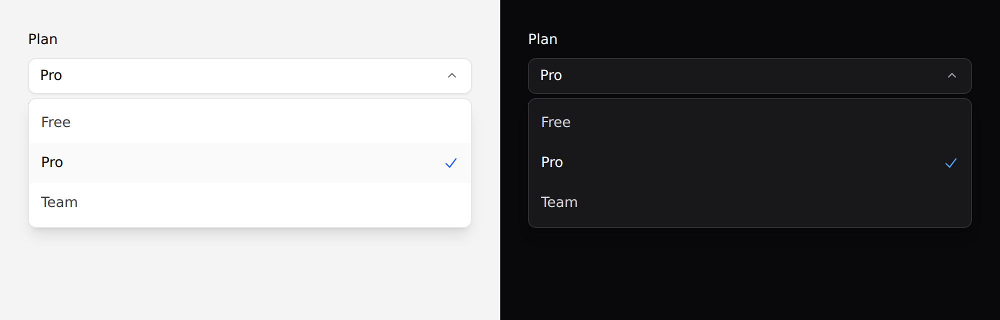

# Select

A styled single-choice field. A listbox, not a `<select>`.



> **Needs Alpine.** See [getting started](../getting-started.md#alpine).

## Which select

There are two, and the native one is often right:

| | `x-ds::select` | `x-ds::input as="select"` |
|---|---|---|
| Renders | a listbox you can style | the OS control |
| Needs JS | yes | no |
| On a phone | a popup list | the native wheel or sheet |
| Typeahead | no | yes, free |

**Prefer the native one on anything phone-first, and for long or unfamiliar
lists.** This exists because the popup of a native `<select>` cannot be styled
at all.

## Use it

```blade
<x-ds::select
    name="plan"
    label="Plan"
    :options="['free' => 'Free', 'pro' => 'Pro', 'team' => 'Team']"
    :value="old('plan', $user->plan)"
/>
```

## Props

| Prop | Type | Default | What it does |
|---|---|---|---|
| `name` | string | *required* | The submitted field name. |
| `options` | array | `[]` | `value => label`. |
| `value` | string | — | The selected value. |
| `label` | string | — | Field label. |
| `placeholder` | string | `Select…` | Shown when nothing is selected. |
| `help` | string | — | Guidance under the field. |
| `error` | string | — | Validation message. |
| `disabled` | bool | `false` | |

`options` is an **array, not slot children**, because the trigger has to render
the selected option's label — the component must be able to look a value up.

## It posts like a normal field

The value rides in a hidden input, so this submits in a plain form exactly like
a `<select>`:

```blade
<form method="POST" action="/settings">
    @csrf
    <x-ds::select name="plan" label="Plan" :options="$plans" :value="old('plan', $user->plan)" />
    <x-ds::button type="submit">Save</x-ds::button>
</form>
```

With Livewire, bind the same way you would any field:

```blade
<x-ds::select name="plan" wire:model.live="plan" :options="$plans" :value="$plan" />
```

## Keyboard

Everything a select should do: **ArrowDown opens it**, arrows move, Home and End
jump, Enter and Space choose, Escape closes, Tab closes and moves on.

Focus enters the **selected** option, not the first — opening a list of forty
countries at the top when "Zambia" is chosen loses the reader's place.

## Accessibility

- The trigger is a `combobox` with a live `aria-expanded`; the list is a
  `listbox` and the options are `option`s with `aria-selected`.
- `error` sets `aria-invalid` and wires `aria-describedby`.
- The selected option shows **a tick as well as a weight change** — weight alone
  is not reliable when comparing two rows.
- It renders its selected state from PHP, so there is no flash of the wrong
  option before Alpine boots.

## Don't

- **Don't use it for actions.** A menu of verbs is a [dropdown](dropdown.md).
- **Don't put more than about fifteen options in it.** There is no typeahead and
  no search.
- **Don't omit `name`.** The hidden input is the only reason this submits.
- **Don't reach for it on a phone-first screen.** See the top of this page.

More in [specs/select.md](../../specs/select.md).
