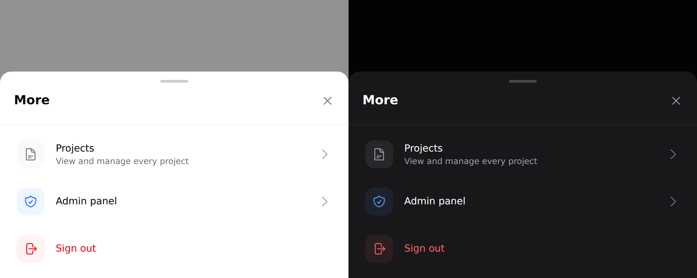

# Sheet

The mobile form of a modal or a drawer. Covers `sheet` and `sheet-item`.



> **Needs Alpine.** See [getting started](../getting-started.md#alpine).
> The sheet is `lg:hidden` — it does not render above the `lg` breakpoint.

## Use it

```blade
<div x-data="{ moreOpen: false }">
    <x-ds::button @click="moreOpen = true">More</x-ds::button>

    <x-ds::sheet open="moreOpen" title="More services">
        <x-ds::sheet-item href="/projects" label="Projects" description="View and manage every project">
            <x-slot:icon><x-ds::icon name="document-text" size="5" /></x-slot:icon>
        </x-ds::sheet-item>

        <x-ds::sheet-item label="Sign out" tone="danger" as="button">
            <x-slot:icon><x-ds::icon name="arrow-right-on-rectangle" size="5" /></x-slot:icon>
        </x-ds::sheet-item>
    </x-ds::sheet>
</div>
```

## `sheet` props

| Prop | Type | Default | What it does |
|---|---|---|---|
| `open` | Alpine expression | *required* | The boolean **you** declare. |
| `title` | string | — | Heading and close button. |
| `maxHeight` | CSS length | `85vh` | Cap on the panel height. |

## `sheet-item` props

| Prop | Type | Default | What it does |
|---|---|---|---|
| `label` | string | *required* | |
| `description` | string | — | Second line. |
| `href` | string | — | Makes it a link. |
| `tone` | `neutral` `accent` `danger` | `neutral` | |
| `as` | string | — | Force the element — `button` for a submit. |
| `disabled` | bool | `false` | |
| `chevron` | bool | follows the element | |

Plus an `icon` slot.

## It stops short of the top

Capped at 85% of the viewport, never full height. Leaving the page visible
behind it is what makes a sheet feel *dismissible* — a full-height takeover
reads as a new screen, and the reader loses the thread of where they were.

## The chevron follows the element, not the styling

A chevron is a claim that the row goes somewhere. A link gets one; a submit
button does not. Sign out is a `POST`, so giving it a chevron would promise a
page it never shows. Disabled rows render as a `div` and fall out of the same
rule.

## Tone: three, not ten

`neutral` | `accent` | `danger`. **Not a free-form colour.**

Only two kinds of row earn a tone, and they differ in *kind* rather than in
feature: `accent` for a role-gated door out of the app, `danger` for the one row
that ends the session. If a new row wants a tone, the question is which of those
two it belongs to — not which colour is still unused.

## Don't

- **Don't nest a sheet in a sheet.**
- **Don't use one above `lg`.** It is the mobile form of a modal, not a second one.
- **Don't give a non-navigating row a chevron.**

More in [specs/sheet.md](../../specs/sheet.md).
