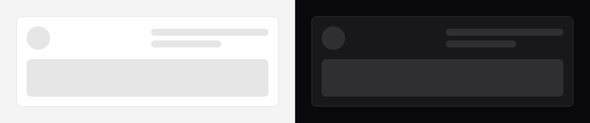

# Skeleton

A picture of content that does not exist yet.



## Use it

```blade
<div aria-busy="true" aria-live="polite">
    <x-ds::skeleton :lines="3" />
</div>
```

## Props

| Prop | Type | Default | What it does |
|---|---|---|---|
| `variant` | `text` `block` `circle` | `text` | Which shape. |
| `lines` | int | `3` | Bars, for `text`. The last one is short. |
| `size` | `sm` `md` `lg` | `md` | Height of a `block`, diameter of a `circle`. |

## The wrapper is your job

**The skeleton is `aria-hidden`** — it has nothing to announce, and left visible
to a screen reader it reads as a run of empty elements, which is worse than
silence.

So the region it stands in carries the announcement:

```blade
<div aria-busy="true" aria-live="polite">
    <x-ds::skeleton :lines="3" />
</div>
```

When the content arrives, `aria-busy` goes to `false` and the live region
announces it. **Without this a screen reader user is told nothing at all** — the
page goes quiet for as long as the request takes, and there is no way to tell
that from a page that has finished.

## Composing one

Match the shape of what is coming, roughly:

```blade
<div class="flex items-center gap-3" aria-busy="true">
    <x-ds::skeleton variant="circle" size="md" class="w-auto" />
    <x-ds::skeleton :lines="2" />
</div>
```

`circle` and `block` fill their container's width by default, so a circle in a
flex row wants `class="w-auto"`.

## Motion

The pulse is `motion-safe` only. With reduced motion it is a static grey bar,
which reads as "not yet" perfectly well.

## Don't

- **Don't skeleton something you can show.** Cached content beats a skeleton that
  replaces content the reader could already be reading.
- **Don't use it for an empty result.** That is [empty state](empty-state.md) — a
  skeleton that never resolves looks like a hung page.
- **Don't show it for under ~200ms.** A flash of grey bars reads as a glitch.
- **Don't chase a pixel-accurate outline** of the real layout. It drifts the
  moment the layout changes.

More in [specs/skeleton.md](../../specs/skeleton.md).
