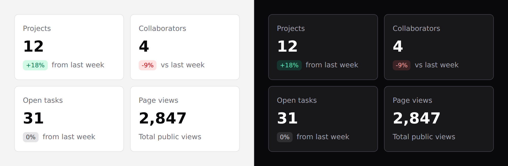

# Stat tile

One number, with its change.



## Use it

```blade
<x-ds::stat-tile label="Projects" value="12" :delta="18" href="/projects" />
```

## Props

| Prop | Type | Default | What it does |
|---|---|---|---|
| `label` | string | *required* | What is being counted. |
| `value` | string\|int | *required* | The number. Passed as-is when not numeric, so `"—"` works. |
| `delta` | int\|float | — | The change, as a **number**. `null` hides the chip. |
| `caption` | string | `from last week` | The text beside the delta, or replaces it when there is no delta. |
| `href` | string | — | Makes the whole tile a link. |
| `countUp` | bool | `true` | Count up from zero on first paint. |

## `delta` is a number, and its sign picks the colour

Pass `:delta="18"` — not `"+18%"`. The component adds the sign and the `%`, and
**derives the tone from the sign**. There are three cases, not two:

| `delta` | Chip | Tone |
|---|---|---|
| `18` | `+18%` | `success` |
| `-9` | `-9%` | `danger` |
| `0` | `0%` | `neutral` — no sign, no colour |
| omitted | no chip at all | — |

```blade
<x-ds::stat-tile label="Collaborators" value="4" :delta="-9" />   {{-- red, "-9%" --}}
<x-ds::stat-tile label="Open tasks"   value="31" :delta="0" />    {{-- grey, "0%" --}}
```

**Zero is flat, not a small rise.** Until v1.1 it rendered a green `+0%`: the
colour that means "up" and the sign that means "up", on the one reading that
means neither. A dashboard of those quietly claims everything is growing.

There is no `deltaTone` prop. Passing a string like `"+12%"` does **not** error —
it just compares as a string and lands on the wrong colour.

> A rise is not always good news. For a metric where up is bad — churn, errors,
> latency — the automatic green will be wrong. Either omit `delta` and use
> `caption`, or show the inverse.

## No delta, or no comparison yet

Omit `delta` and pass `caption` instead. The component deliberately does **not**
render a `0%` chip in that case: "no change" and "nothing to compare against
yet" are different statements, and a `0%` reads as the first. That is exactly
why `:delta="0"` *does* render one — it is the statement that means "no change".

```blade
<x-ds::stat-tile label="Page views" value="2847" caption="Total public views" />
```

## Count-up

Numeric values animate up from zero on first paint, and the animation is
**skipped automatically** when the reader has asked for reduced motion — the
final value is already in the DOM, so nothing is lost.

Thousands are grouped server-side, so the number does not silently reformat when
the script runs. Turn it off with `:countUp="false"`.

The script is pushed to a `scripts` stack, so your layout needs `@stack('scripts')`
before `</body>` for the animation to run. Without it the tile still renders the
final value correctly.

## Don't

- **Don't put a delta on a metric with no meaningful comparison.**
- **Don't use it for a value that is not a headline.** A grid of nine tiles has no
  headline.
- **Don't pass a pre-formatted delta string.** See above.

More in [specs/stat-tile.md](../../specs/stat-tile.md).
