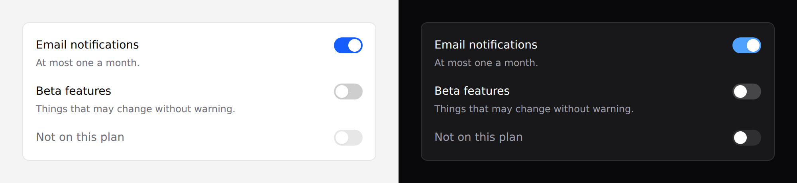

# Switch

A setting that takes effect. Not a [checkbox](checkbox.md).



## Use it

```blade
<x-ds::switch name="notifications" label="Email notifications" :checked="$user->notifications" />
```

## Props

| Prop | Type | Default | What it does |
|---|---|---|---|
| `label` | string | *required* | The setting's name. |
| `name` | string | — | Submitted field name. |
| `help` | string | — | Guidance under the label. |
| `checked` | bool | `false` | |
| `disabled` | bool | `false` | |
| `submitUnchecked` | bool | `true` | Emit a hidden `0` so the field posts when off. |

## Switch or checkbox

| | Switch | Checkbox |
|---|---|---|
| Reads as | on / off | selected / not selected |
| Announces | "on", "off" | "checked", "unchecked" |
| Label | left, control right | right of the box |

**"Unchecked" for a setting that is simply off reads as a form the reader failed
to fill in.** That's what `role="switch"` fixes, and it's the whole reason this
exists next to `checkbox`.

## `submitUnchecked` — the prop that will bite you

**An unchecked checkbox sends nothing.** Without a hidden `0` alongside it, a
setting can be turned on and never turned off again through a plain form: the
request has no key for it, and your controller reads that as "unchanged".

That's on by default, so `$request->boolean('notifications')` just works:

```blade
<form method="POST" action="/settings">
    @csrf
    <x-ds::switch name="notifications" label="Email notifications" :checked="$user->notifications" />
    <x-ds::button type="submit">Save</x-ds::button>
</form>
```

Turn it off when something else owns the value, where a stray `0` would be noise:

```blade
<x-ds::switch name="notifications" label="Email notifications"
              wire:model.live="notifications" :submitUnchecked="false" />
```

## A group of settings

```blade
<x-ds::panel title="Notifications" body="plain">
    <div class="flex flex-col gap-4">
        <x-ds::switch name="email" label="Email" help="At most one a month." :checked="$s->email" />
        <x-ds::switch name="sms" label="SMS" :checked="$s->sms" />
        <x-ds::switch name="digest" label="Weekly digest" :disabled="! $s->canDigest" />
    </div>
</x-ds::panel>
```

## Don't

- **Don't use it in a form the reader must submit** without making clear the change
  isn't saved yet. A switch *looks* like it already took effect.
- **Don't use it for a choice between two named things.** "Light / Dark" is a radio
  pair — a switch's off state has no name.
- **Don't put one in a table row as a bulk action.** It reads as applied
  immediately, and there's no undo.

More in [specs/switch.md](../../specs/switch.md).
