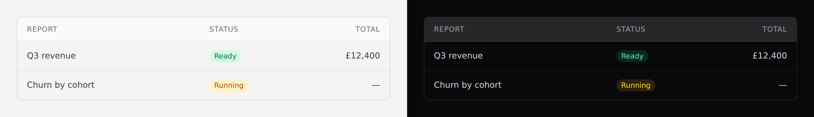

# Table

Rows of records. Covers `table`, `table-row` and `table-cell`.



## Use it

Headers come from the **`columns` prop**, not from a slot:

```blade
<x-ds::table :columns="['Report', 'Status', ['label' => 'Total', 'align' => 'right']]">
    @foreach ($reports as $report)
        <x-ds::table-row :href="route('reports.show', $report)">
            <x-ds::table-cell>{{ $report->name }}</x-ds::table-cell>
            <x-ds::table-cell :nowrap="true">
                <x-ds::badge :tone="$report->tone">{{ $report->status }}</x-ds::badge>
            </x-ds::table-cell>
            <x-ds::table-cell align="right">{{ $report->total }}</x-ds::table-cell>
        </x-ds::table-row>
    @endforeach
</x-ds::table>
```

## `columns`

Each entry is either a **label**, or an array:

```php
['label' => 'Joined', 'align' => 'right', 'width' => 'w-36']
```

| Key | Values | What it does |
|---|---|---|
| `label` | string | The header text. An empty string reserves the column without a heading — for an actions column. |
| `align` | `left` `center` `right` | Defaults to `left`. |
| `width` | Tailwind class | Fixes the column width. |

Omit `columns` entirely and supply your own `<thead>` in the slot.

> **`width` is a class from *your* source.** It works because Tailwind scans your
> views and finds the literal `w-36` there. Build it dynamically — `'w-'.$n` — and
> it silently has no rule and no width. Write it out.

## `table-row` and `table-cell`

| Component | Prop | Default | What it does |
|---|---|---|---|
| `table-row` | `href` | — | Makes the whole row a link. |
| `table-row` | `hover` | `true` | Row hover fill. |
| `table-cell` | `align` | `left` | `left` `center` `right`. |
| `table-cell` | `nowrap` | `false` | Stops the cell wrapping. |

**`nowrap` is right for dates, counts and badges; wrong for prose** — a
non-wrapping sentence forces the whole table sideways.

## It scrolls inside its own box

The table sits in an `overflow-x-auto` container, so a wide table scrolls within
its rounded border rather than pushing the page sideways. On a phone, a page
that scrolls horizontally is indistinguishable from a broken one.

## Empty tables

Keep the header and put an [empty state](empty-state.md) in the body — the
reader needs to know *what* is empty:

```blade
<x-ds::table :columns="['Report', 'Status']">
    @forelse ($reports as $report)
        …
    @empty
        <tr><td colspan="2">
            <x-ds::empty-state title="No reports yet" :bare="true" />
        </td></tr>
    @endforelse
</x-ds::table>
```

## Don't

- **Don't put an interactive control inside a linked row.** A button inside an
  `<a>` is invalid and the click target becomes ambiguous. Give the row no
  `href` and link the first cell instead.
- **Don't build `width` dynamically.** See above.
- **Don't use a table for layout.**

More in [specs/table.md](../../specs/table.md).
