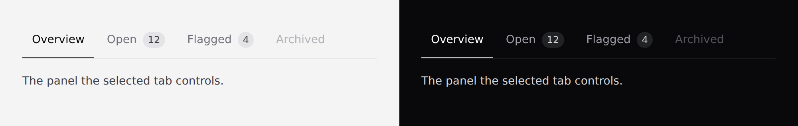

# Tabs

One row, several views. Covers `tabs`, `tab` and `tab-panel`.



## Decide this first: are they links?

**`navigation` is not a styling flag. It is the accessibility contract.**

| The tabs are… | Use | You get |
|---|---|---|
| buttons that swap content on this page | `navigation="false"` (default) | `role="tablist"`, `aria-selected`, `aria-controls` |
| links to other pages | `navigation="true"` | `<nav>`, `aria-current="page"` |

`role="tablist"` **promises** a screen reader that arrow keys move between tabs
and the content changes in place. Put it on a row of page links and both halves
are false — arrow keys do nothing, and following one navigates away entirely.

This is the most common tabs bug and it is invisible without a screen reader.

## Links to other pages

```blade
<x-ds::tabs label="Account settings" :navigation="true">
    <x-ds::tab href="/settings/profile" :active="request()->is('settings/profile')">Profile</x-ds::tab>
    <x-ds::tab href="/settings/billing" count="3">Billing</x-ds::tab>
</x-ds::tabs>
```

## Panels on this page

```blade
<div x-data="{ tab: 'overview' }">
    <x-ds::tabs label="Report sections">
        <x-ds::tab controls="p-overview" ::active="tab === 'overview'" @click="tab = 'overview'">Overview</x-ds::tab>
        <x-ds::tab controls="p-open" count="12" ::active="tab === 'open'" @click="tab = 'open'">Open</x-ds::tab>
    </x-ds::tabs>

    <x-ds::tab-panel id="p-overview" ::active="tab === 'overview'">…</x-ds::tab-panel>
    <x-ds::tab-panel id="p-open" ::active="tab === 'open'">…</x-ds::tab-panel>
</div>
```

Note `::active` — the double colon is Blade escaping a colon so Alpine gets
`:active`.

## Props

| Component | Prop | Default | What it does |
|---|---|---|---|
| `tabs` | `label` | *required* | Names the set. |
| `tabs` | `navigation` | `false` | See above. |
| `tab` | `href` | — | Makes it a link. |
| `tab` | `active` | `false` | |
| `tab` | `controls` | — | `id` of the panel it controls. |
| `tab` | `count` | — | A number beside the label. |
| `tab` | `disabled` | `false` | |
| `tab-panel` | `id` | *required* | Must match the tab's `controls`. |
| `tab-panel` | `active` | `false` | |
| `tab-panel` | `labelledby` | — | `id` of the controlling tab. |

## What you own

Which tab is active, and — for real tabs — **the arrow keys**, since only you
know the set. The component does its half with a roving `tabindex`, so only the
selected tab is in the tab order.

## `count` is a number, not a status

How many things are behind the tab. Anything that needs a colour is a
[badge](badge.md) and probably does not belong in a tab.

## Don't

- **Don't put `role="tablist"` on page links.** See the top of this page.
- **Don't hide required form fields in an inactive tab.** The browser cannot focus
  an invalid control inside a hidden panel, so submit fails with no visible
  reason.
- **Don't use tabs for a sequence.** Tabs are peers; steps are a wizard.

More in [specs/tabs.md](../../specs/tabs.md).
