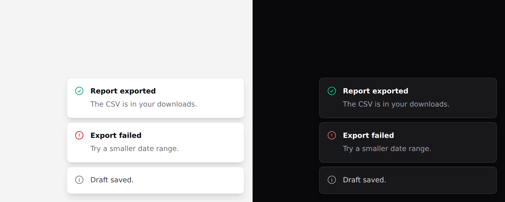

# Toast

A brief report that something already happened. Covers `toast` and
`toast-region`.



> `dismiss` is the one prop here that needs
> [Alpine](../getting-started.md#alpine) — it takes an expression that removes the
> toast. Everything else works in a plain Blade view.

## Put the region in your layout, once

```blade
{{-- resources/views/layouts/app.blade.php --}}
<x-ds::toast-region position="bottom-right" />
```

**Always rendered, and empty most of the time.** A live region only announces
content that arrives *after* it is in the document — render the region together
with the first toast and **the first toast is silent**, which is the one a reader
most needs to hear.

## Then add toasts

```blade
<x-ds::toast-region position="bottom-right">
    @foreach ($toasts as $toast)
        <x-ds::toast :tone="$toast->tone" :title="$toast->title" dismiss="…">
            {{ $toast->body }}
        </x-ds::toast>
    @endforeach
</x-ds::toast-region>
```

## `toast-region` props

| Prop | Type | Default | What it does |
|---|---|---|---|
| `position` | `bottom-right` `top-right` `bottom-center` `top-center` | `bottom-right` | |
| `label` | string | `Notifications` | The region's name in a landmark list. |

## `toast` props

| Prop | Type | Default | What it does |
|---|---|---|---|
| `tone` | `neutral` `accent` `success` `warning` `danger` | `neutral` | Lives in the icon. |
| `title` | string | — | Bold first line. |
| `icon` | string | tone's default | |
| `dismiss` | Alpine expression | — | Renders a close control that runs this. |

Plus an `action` slot.

## Toast or alert

**Anything the reader must act on is not a toast.** It is on screen for a few
seconds, somewhere their eyes are not, and on a phone it may be under a thumb.

A failure that needs a retry belongs in an [alert](alert.md) next to the thing
that failed.

## Timing is yours

The component holds no state and no timer. What to aim for:

- **~5 seconds** for a plain confirmation.
- **Longer, or never, when the toast has an action.** "Undo" on a 3-second timer
  is a button that is gone before the reader finished reading the sentence
  offering it.
- **Pause on hover and on focus**, or someone moving to click Undo watches it
  disappear under the pointer.

## Accessibility

The region is `aria-live="polite"` — never assertive. A toast reports something
that already happened, and interrupting someone to say a thing they just did
worked is exactly the rudeness `polite` exists to avoid.

## Don't

- **Don't stack more than about three.** Four is a log, and a log belongs on a page.
- **Don't put a form in one.** It can vanish mid-typing.
- **Don't use one for a validation error.** The field needs the message.
- **Don't put the only copy of an "Undo" behind a timer.**

More in [specs/toast.md](../../specs/toast.md).
