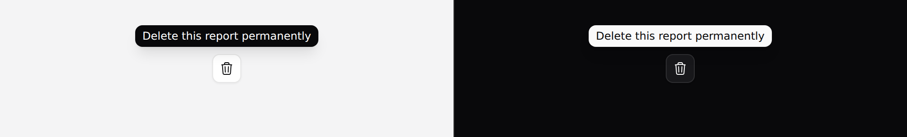

# Tooltip

A short label that appears on hover or focus.



> **Needs Alpine.** See [getting started](../getting-started.md#alpine).

## Use it

```blade
<x-ds::tooltip text="Delete this report permanently">
    <x-ds::button variant="secondary" size="sm" iconOnly aria-label="Delete">
        <x-ds::icon name="trash" size="4" />
    </x-ds::button>
</x-ds::tooltip>
```

## Props

| Prop | Type | Default | What it does |
|---|---|---|---|
| `text` | string | *required* | The tip. Plain text, and short. |
| `placement` | `top` `bottom` `left` `right` | `top` | |

## It is never the only copy

The tip is `aria-describedby` — **supplementary**. The trigger keeps its own
accessible name, which is why the example above has both an `aria-label` on the
button *and* a tooltip.

This matters because a tooltip is the least reliable place in an interface to
put information: it does not exist on a touch screen, it does not exist in a
printout, and it disappears the moment the pointer moves.

**The common mistake is an icon-only button whose only label is its tooltip.**

## What you get

Hover **and** focus, always both — a tip that only appears on hover does not
exist for a keyboard. Escape dismisses it, which is [WCAG
1.4.13](https://www.w3.org/WAI/WCAG22/Understanding/content-on-hover-or-focus.html)
and the part everyone forgets.

The tip never eats the pointer, so hovering the trigger does not flicker.

## Don't

- **Don't put anything interactive in it.** A link or button inside a tooltip is
  unreachable for everyone not using a mouse. That is why `text` is a string prop
  and not a slot — the component makes it impossible.
- **Don't attach one to a disabled button.** A disabled control fires no pointer
  events in most browsers, so the tip explaining *why* never appears. Explain it
  in the page instead.
- **Don't rely on it for a phone-first screen.** There is no hover.
- **Don't repeat the visible label.**

More in [specs/tooltip.md](../../specs/tooltip.md).
